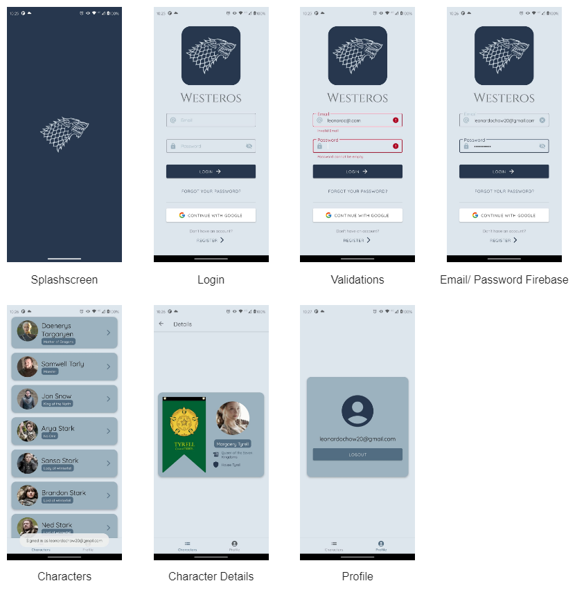
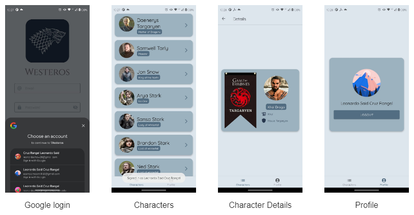
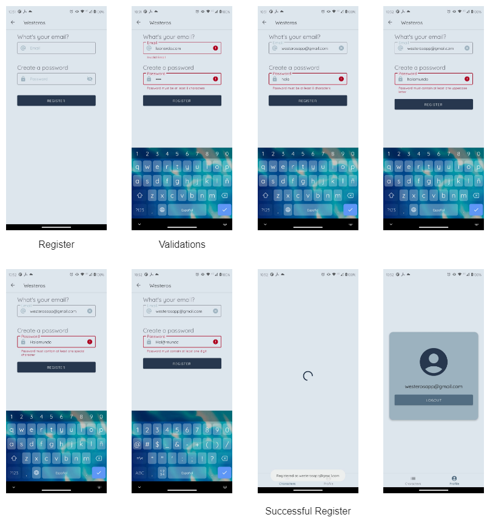

# WESTEROS

Game of Thrones Character wiki that utilizes data from [thronesapi.com](https://thronesapi.com/).

Link to [Google Drive](https://drive.google.com/drive/folders/1lTuEie8JxhN7tv5rXNqyIaRkzUliEFsz?usp=sharing)

## Screenshots

## Demonstration

## Features

This app was built with modern Android development practices and tools. It showcases the following concepts:

- [x] Kotlin
- [x] MVVM
- [x] Clean Architecture
- [x] Coroutines
- [x] Dagger Hilt
- [x] Retrofit
- [x] Moshi
- [x] Coil
- [x] Navigation Component
- [x] LiveData
- [x] ViewModel
- [x] Material Design

## Next Steps

This app is not perfect and there are a few things that can be improved:

- [ ] Add forgot password functionality
- [ ] Improve profile screen
- [ ] Create a favorites screen that allows users to save their favorite characters
- [ ] Add a search feature
- [ ] Expand api response to include more information about each character using a local database
- [ ] Save user data in a local database
- etc.